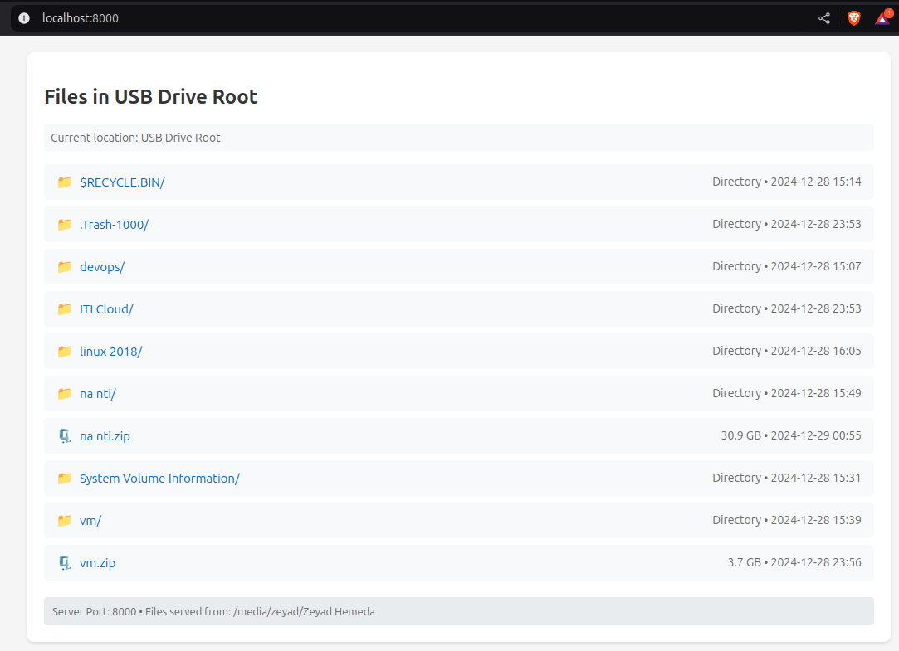

# Local Network File Sharing

A high-performance HTTP file server with a modern GUI interface, optimized for fast file transfers and built with Python. This application allows you to easily share files across your local network with an emphasis on speed and efficiency.

 `<!-- You should add a screenshot of your GUI here -->`

## Features

- **High-Performance File Transfer**

  - Optimized for large files using memory mapping
  - Zero-copy transfers when possible
  - Efficient chunked transfer encoding
  - Support for range requests (resume downloads)
  - Optimized for sharing large ZIP files
- **Modern GUI Interface** (Coming Soon)

  - Easy directory selection
  - One-click server start/stop
  - Real-time server status
  - Network information display
  - Clean, modern design
- **Network Capabilities**

  - Local and network-wide access
  - Automatic IP detection
  - Multiple simultaneous connections
  - Threaded request handling
- **File Management**

  - Clean file listing interface
  - File size and date information
  - Special icons for different file types
  - Directory navigation
  - Breadcrumb path display

## Performance Optimizations

- Memory mapping for large files
- Optimized buffer sizes (2MB read/write buffers)
- TCP socket optimizations
- Efficient file handling
- Threaded server implementation
- Zero-copy transfers where available

## Requirements

- Python 3.8+
- PyQt5 (for GUI version - coming soon)
- Modern web browser
- Network connection

## Installation

1. Clone the repository:

```bash
git clone https://github.com/T1t4n25/Local-Network-file-sharing.git
cd Local-Network-file-sharing
```

Install required packages:

```bash
pip install PyQt5  # For GUI version
```

Run the application:

```bash
# for no gui
python main.py
# for gui version
python gui.py
```

# System optimizations for ubuntu (optional)

```bash
# Add to /etc/sysctl.conf
net.core.rmem_max = 16777216
net.core.wmem_max = 16777216
net.ipv4.tcp_rmem = 4096 87380 16777216
net.ipv4.tcp_wmem = 4096 65536 16777216
net.ipv4.tcp_window_scaling = 1
net.ipv4.tcp_timestamps = 1
net.ipv4.tcp_sack = 1
net.core.netdev_max_backlog = 5000
```

# Technical Details

Server Implementation: Custom HTTP server based on Python's http.server
GUI Framework: PyQt5 

### Transfer Methods:

* Memory mapping for large files.
* Chunked transfer for streaming.
* Direct transfer for small files.

### Optimization Features:

* 2MB buffer sizes
* TCP socket tuning
* Zero-copy transfers
* Range request support
